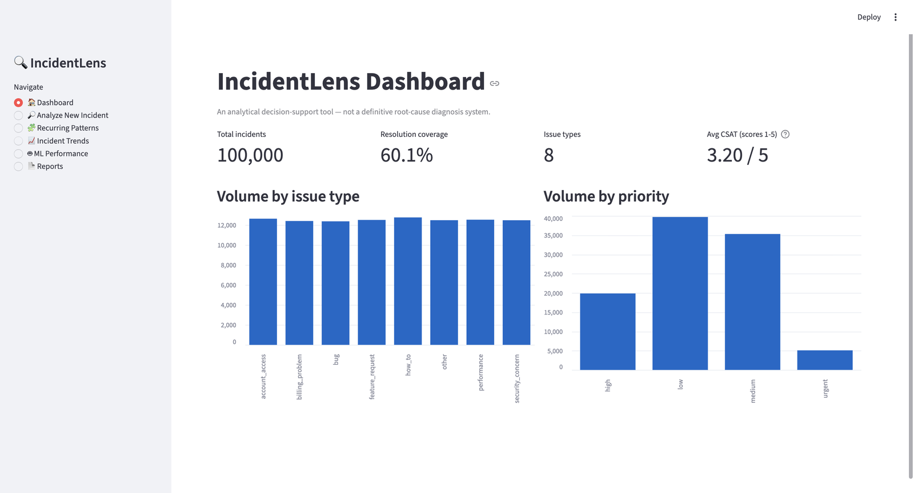
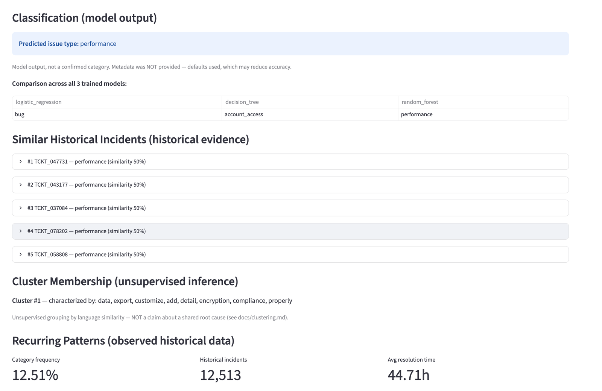
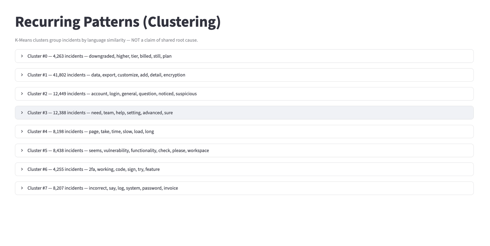
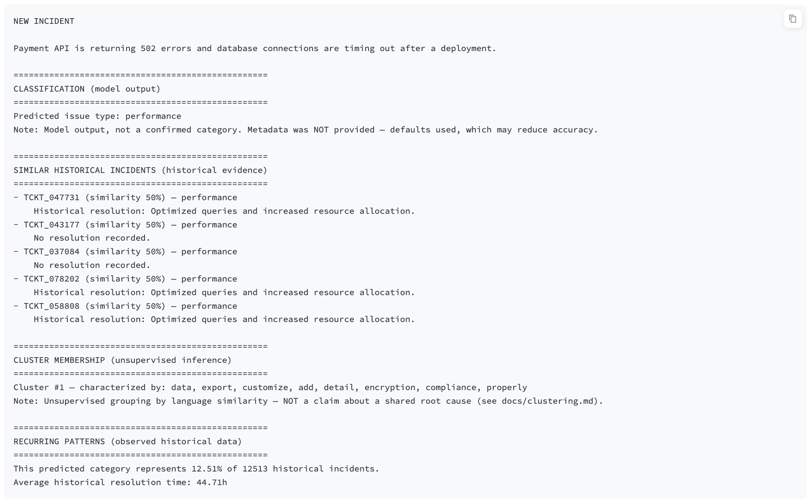

# IncidentLens

**An Intelligent IT Incident Similarity and Historical Resolution Analysis System**

A solo BSc CSIT certification and portfolio project. IncidentLens helps an IT
support team learn from past incidents: given a new incident description, it
retrieves historically similar incidents, shows how they were resolved,
classifies the incident, and surfaces recurring patterns, as evidence and
never as a definitive root cause.

Status: working college-demonstration prototype. Runtime tests pass in a fresh local environment; a v1.0.0 release and independent real-world validation are still pending.

## Problem statement

When a new IT incident occurs, responders often cannot quickly tell whether a
similar one has happened before, what caused it, and how it was resolved,
because historical incident data is unstructured and not searchable by
meaning.

## Objectives

1. Acquire and document a real incident dataset.
2. Build reproducible cleaning and NLP pipelines.
3. Retrieve similar historical incidents with TF-IDF and cosine similarity.
4. Evaluate retrieval on a controlled test set.
5. Discover recurring patterns with clustering.
6. Train and honestly evaluate a classifier (three models compared).
7. Explain why incidents were considered similar.
8. Provide a dashboard and downloadable reports.
9. Test, measure, and harden the system.

## Features

- Similar-incident retrieval with historical resolutions and a per-term "why similar?" breakdown
- Issue-type classification with a side-by-side comparison of Logistic Regression, Decision Tree, and Random Forest
- K-Means incident clusters with characteristic terms
- Trend and workflow analytics (escalation funnel, time per support level)
- Streamlit dashboard with six pages
- Downloadable HTML report with an embedded chart and an explicit limitations section
- Every output is labelled by evidence type: observed data, model output, historical evidence, or inference

## Architecture

```
IncidentLens/
├── app.py                    Streamlit dashboard
├── src/
│   ├── config.py             paths
│   ├── data_loader.py        validated CSV loading
│   ├── preprocessing.py      cleaning pipeline
│   ├── nlp_processor.py      lowercase, punctuation, stopwords, lemmatization
│   ├── vectorizer.py         TF-IDF
│   ├── similarity_engine.py  cosine-similarity retrieval
│   ├── retrieval.py          enriched results and report format
│   ├── evaluation.py         Hit@K and Precision@K
│   ├── clustering.py         K-Means
│   ├── feature_engineering.py  leakage-safe feature matrix
│   ├── classifier.py         three baseline models
│   ├── model_evaluation.py   metrics and template-holdout split
│   ├── analyzer.py           intelligence engine (integrates everything)
│   ├── explainability.py     similarity and classifier explanations
│   └── report_generator.py   HTML report (escaped output)
├── scripts/                  runnable pipeline and analysis steps
├── tests/                    133 automated tests
├── notebooks/                01_data_exploration.ipynb
├── docs/                     methodology and decisions
├── reports/                  generated results
└── data/                     raw/ processed/ test/ (raw and processed are gitignored)
```

Differences from the original target structure: there is no `visualizer.py`
(charts are produced in the scripts and the notebook), and only one notebook
(`01_data_exploration.ipynb`) was created. Extra modules were added where a
stage needed them (`retrieval.py`, `evaluation.py`, `model_evaluation.py`,
`explainability.py`).

## Installation

No GitHub login, Kaggle account, API key, or access to the author's device is
needed to run the dashboard. Install **64-bit Python 3.12** and download this
public repository (a Git clone or GitHub's Download ZIP both work).

```bash
git clone https://github.com/nitesh-khanal/IncidentLens.git
cd IncidentLens
```

**Windows:**
```powershell
py -3.12 run.py
```

**macOS / Linux:**
```bash
python3.12 run.py
```

The launcher creates `.venv` inside the project, installs the pinned packages,
checks the shipped data and models, and opens the dashboard. Internet access is
needed for the initial package installation. After setup, the dashboard runs
offline: the trained models, 100,000 historical tickets, and required English
language resources are included. No separate training or dataset download is
needed. Use a writable project folder; the launcher does not require administrator
access. On Linux, your Python installation must include `venv` and `pip` support.

Check setup without starting the app with `run.py --check`, or use
`run.py --port 8502` if the default port is occupied. Use the same Python command
shown above before these arguments. If you move the repository to another device,
create a new environment there; do not copy `.venv` between devices.

Python and package versions are pinned because the serialized models depend on
the training environment. The CI workflow checks clean installs on Windows,
macOS, and Linux. See [portability checks](docs/PORTABILITY.md).

### Reproducing the pipeline from raw data (optional)

Not needed to run the app. Needed only to regenerate the committed
artifacts yourself, verify the results independently, or work on an
earlier pipeline stage. Requires a free Kaggle account.

Install the optional research dependencies with `python -m pip install -r requirements-research.txt` in your environment.

Save your Kaggle API token to `~/.kaggle/access_token` (never commit it), then:

```bash
cd data/raw
kaggle datasets download -d ahsanneural/synthetic-it-support-tickets
unzip synthetic-it-support-tickets.zip && rm synthetic-it-support-tickets.zip
kaggle datasets download -d albertopmd/process-mining-event-log-incident-management
unzip process-mining-event-log-incident-management.zip && rm process-mining-event-log-incident-management.zip
cd ../..
```

## Dataset sources, licenses and attribution

| Role | Dataset | Size | License |
|---|---|---|---|
| Primary (NLP, similarity, clustering, classification) | "IT Support Tickets" by ahsanneural, Kaggle: `ahsanneural/synthetic-it-support-tickets` | 100,000 rows, 20 columns | CC BY 4.0 |
| Secondary (workflow analytics only) | "Process Mining Event Log - Incident Management" by albertopmd, Kaggle: `albertopmd/process-mining-event-log-incident-management` | 31,588 incidents, 242,901 events | MIT |

Attribution for the primary dataset: contains data from "IT Support Tickets" by
ahsanneural (https://www.kaggle.com/datasets/ahsanneural/synthetic-it-support-tickets),
licensed under CC BY 4.0 (https://creativecommons.org/licenses/by/4.0/). The raw
data is not modified; derived versions are written separately to `data/processed/`.

Also evaluated but not used as the primary or secondary dataset:
`ameau01/synthetic-it-support-tickets` (Hugging Face, MIT, 745 records) and
LogHub (see `docs/optional_log_analysis_evaluation.md`).

The two main datasets share no identifiers and are never joined. Full details
are in `docs/dataset.md`.

## Data preprocessing

`src/preprocessing.py` strips whitespace, normalizes category casing, parses
timestamps, fills missing `region` with `"unknown"`, and flags (never
fabricates) missing resolutions with `has_resolution`. On the real data:
100,000 rows in, 100,000 out, 0 duplicates, and 39,887 tickets (39.9%) with no
recorded resolution. See `reports/data_quality_report.md`.

## NLP pipeline

Lowercase, punctuation removal, stopword removal, and lemmatization. This was
chosen from a measured experiment on 2,000 messages (`docs/nlp_preprocessing.md`):
stopword removal halves the average token count (11.4 to 5.3), and
lemmatization was preferred over stemming because vocabulary size was almost
identical (100 vs 98 terms) while lemmatization keeps readable words for
explanations. The original text is never overwritten; the result is stored in
`processed_message`. The full dataset takes about 43 seconds to process, once,
offline.

## Similarity methodology

TF-IDF vectors (97-term vocabulary after authentication phrase normalization) compared with cosine similarity
(`docs/tfidf_representation.md`). TF-IDF is lexical: it matches shared words,
not meaning. `src/explainability.py` decomposes a score into exact per-term
contributions that sum to the real cosine value.

## Clustering methodology

K-Means on the TF-IDF vectors (`docs/clustering.md`,
`reports/clustering_report.md`). Inertia and silhouette were measured for
k in {4, 6, 8, 10, 12, 15}, but both kept improving as k grew (silhouette rose
from 0.156 at k=4 to 0.537 at k=15), so they did not identify an optimal k.
k=8 was chosen deliberately to match the eight `issue_type` classes, to test
whether unsupervised clustering would rediscover them. A cluster groups
similar language; it is not a claim about a shared root cause.

## Machine learning methodology

Task: predict `issue_type` (8 balanced classes) from information available at
ticket creation. The rebuilt deployment matrix has 136 features: 97 TF-IDF terms, 34 one-hot
categorical features, and 5 numeric or temporal features. Seven fields known
only after resolution (resolution summary and time, `has_resolution`, `status`,
`reopened`, `csat_score`, `customer_sentiment`) are excluded to prevent
leakage, and a runtime assertion enforces this. Three models are compared with
a fixed `random_state` and a stratified 80/20 split
(`docs/ml_problem_definition.md`, `docs/feature_engineering.md`).

## Evaluation and evidence boundaries

Evaluation now splits raw rows before fitting TF-IDF and categorical encoders. A fixed unseen-template holdout and three-fold grouped validation share no normalized templates between training and test. See [the measured model report](reports/model_evaluation.md) and [full methodology](docs/DATASET_LIMITATIONS.md).

- Row-split accuracy remains 100%; repeated descriptions make this an easy task.
- Unseen-template accuracy remains 54.47%. The small account-access category remains difficult; this is not production accuracy.
- Three-fold grouped mean accuracy: Logistic Regression 58.45%, Decision Tree 52.31%, Random Forest 46.30%. Logistic Regression is the primary model because its grouped mean macro F1 is highest.
- The 48 assistant-authored labelled challenge cases and 6 boundary inputs are exploratory, not an independently human-reviewed or real-world benchmark. None are used for fitting or model selection. Read accuracy together with coverage in [the challenge report](reports/challenge_evaluation.md).
- Category suggestions normally require at least three matched vocabulary terms and a model score of at least 0.5. Two-term descriptions can receive a tentative suggestion only with a score ≥0.8, a lead over the next category ≥0.5, and a top historical match in the same category sharing both terms with cosine similarity ≥0.6. One-term keywords still abstain. These gates are heuristics, not calibrated confidence.
- Reviewed WordNet synonyms and support phrases normalize equivalent wording before TF-IDF (for example, sluggish → slow and billed twice → charged twice). Payment and subscription remain different concepts. See [synonym handling](docs/synonym_handling.md).
- The controlled retrieval report is regenerated after normalization: [retrieval results](reports/retrieval_evaluation.md).
- The rebuilt k=8 clustering silhouette is about 0.305 on a fixed 5,000-row sample. Cluster identifiers changed after rebuilding; current sizes are shown in Recurring Patterns and recorded in the validation JSON.
- 133 automated tests pass; see [demonstration verification](reports/demo_verification.md).

The unchanged dataset still has only 96 descriptions. No real incident data or missing resolutions were fabricated.

## Screenshots

These screenshots document the original run. The current app has updated presentation, evidence gates, clusters, and model selection.

**Dashboard.** The primary dataset at a glance: 100,000 incidents, volume by issue type and by priority, and average CSAT. The CSAT card excludes the 29.9% of tickets scored 0, which the dataset does not document; see the note in `docs/dataset.md`.



**Analyze New Incident.** A new incident classified, with the three trained models shown side by side, followed by five similar historical incidents with their resolutions, the incident's cluster, and observed statistics for the predicted category. On this query the three models disagree (Logistic Regression: bug, Decision Tree: account_access, Random Forest: performance), which is consistent with the template-holdout finding under Evaluation: the phrasing is not one of the dataset's templates and no metadata was supplied. The original dashboard reported the Random Forest prediction and labels it as model output, not a confirmed category. Each section below it is labelled by the kind of evidence it is.



**Recurring Patterns.** The eight K-Means clusters with their sizes and characteristic terms. In the original run, Cluster 1 held 41,802 incidents. Current cluster identifiers and sizes differ after normalization.



**Reports.** The plain-text report for the analyzed incident. An HTML version with an embedded chart and a limitations section is also downloadable from this page.



## Demonstration

See [the five-minute demonstration guide](docs/DEMO_GUIDE.md) for setup, a walkthrough, and likely questions. The app includes illustrative examples, persistent results, and explicit model-limit warnings. Prepare the language resources and warm the dashboard before presenting.

## Usage

```bash
streamlit run app.py
```

Pages: Dashboard, Analyze New Incident, Recurring Patterns, Incident Trends,
ML Performance, Reports. Optional metadata supplies ticket context; it does not guarantee better accuracy. When it is
omitted, the report says so. Weak evidence produces an explicit abstention.

Recommended rebuild and validation of the committed demo corpus:

```bash
python -m scripts.rebuild_validated_demo
python -m scripts.evaluate_retrieval
python -m pip install -r requirements-dev.txt
python -m pytest tests/ -q
```

Original raw-data pipeline steps, in order (each writes to `data/processed/` or `reports/`):

```bash
python3 -m scripts.run_cleaning
python3 -m scripts.apply_nlp_preprocessing
python3 -m scripts.build_tfidf
python3 -m scripts.run_clustering
python3 -m scripts.build_features
python3 -m scripts.train_models
python3 -m scripts.evaluate_models
python3 -m scripts.evaluate_retrieval
python3 -m scripts.run_trend_analysis
python3 -m scripts.analyze_event_log
python3 -m pytest tests/ -v
```

## Limitations

- The primary dataset is synthetic and templated (96 unique texts across 100,000 rows), so similarity results often return identical descriptions and row-level accuracy is meaningless as a skill measure.
- TF-IDF is lexical, not semantic, and the rebuilt vocabulary is only 97 terms.
- `account_access` has 3 templates, so classification of new account-lockout phrasing is unreliable.
- The dataset has no root-cause field; `resolution_summary` is the only evidence and is missing for 39.9% of tickets.
- No time trends exist in the data, so trend analysis reports an honest null result.
- Clusters describe language, not causes.
- IncidentLens is decision support. It never determines the true root cause of an incident.

## Future work

- Augment `account_access` with the Hugging Face dataset (514 of 745 records match authentication keywords, 327 unique titles), then re-run the template-holdout test to measure the improvement.
- Validate the normalization and evidence gate on independently reviewed real tickets.
- Compare against sentence-embedding retrieval.
- Validate on a real, non-templated incident dataset.
- Optional infrastructure (FastAPI, Docker, CI) was deliberately not built.

## Documentation index

`docs/`: specification, dataset, NLP preprocessing, TF-IDF representation,
retrieval evaluation, clustering, feature engineering, ML problem definition,
explainability, security, optional log analysis evaluation.

`reports/`: data quality, retrieval evaluation, clustering, trend analysis,
workflow analytics, model evaluation, performance, test report.

## License

No license has been chosen for the IncidentLens source code, so it is under
default copyright (all rights reserved). The datasets keep their own licenses,
listed under "Dataset sources, licenses and attribution" above.

Historical search displays distinct descriptions, with a count of repeated wording.
When available, a representative with a recorded resolution is shown. Different
descriptions can still receive equal lexical similarity scores.
